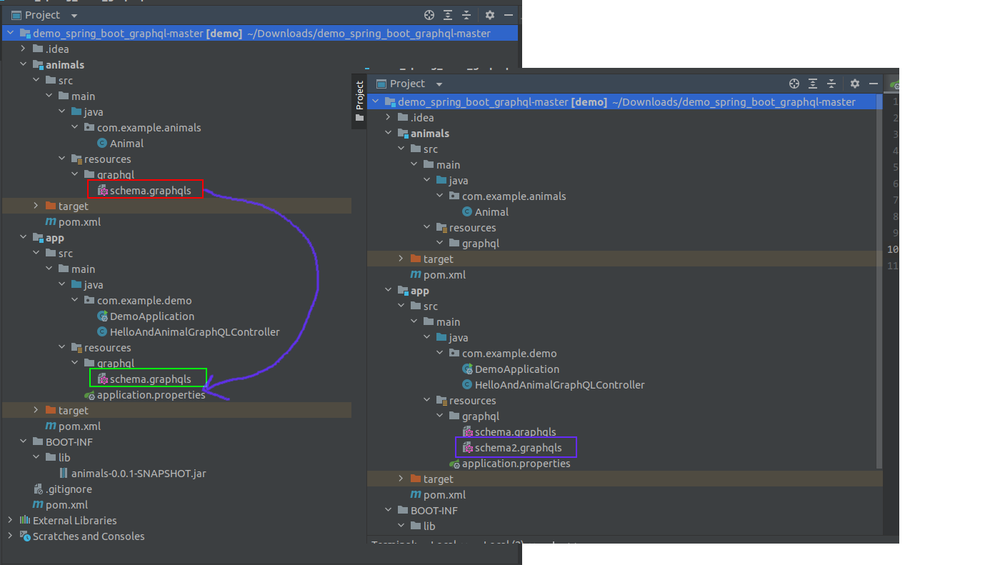
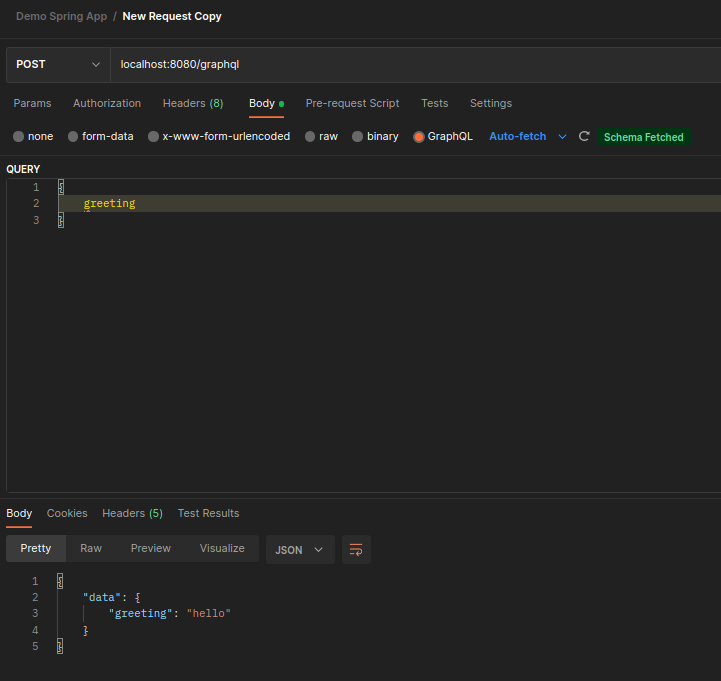
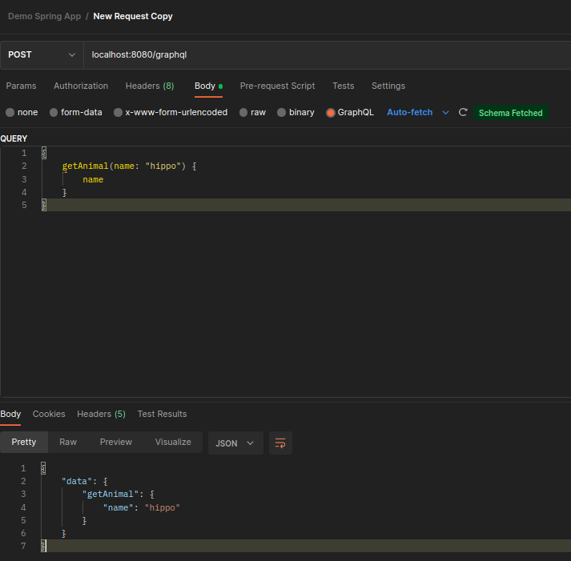

`mvn clean install` from the root of the project.

---
## Fixed
Per [spring-graphql/issues/489](https://github.com/spring-projects/spring-graphql/issues/489#issuecomment-1249089331) changing `spring.graphql.schema.locations` to `classpath*:graphql/**/` caused schema files in animals module to be picked up.

---
## Original Issue

Only works when you move the `schema.graphqls` from the `animal` module to the `app` module.

Working:

